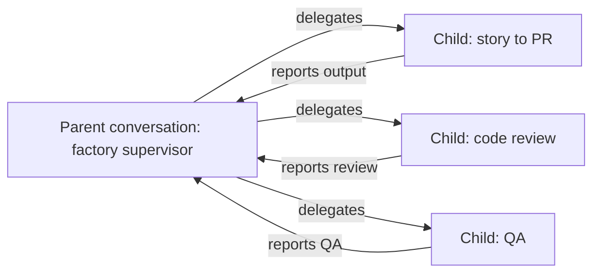

# Agent Canvas SDLC Automation Recipe

This folder contains the Agent Canvas SDLC automation recipe. It is
structured as a reusable software-factory recipe: one parent conversation acts
as the orchestrator, and delegated child conversations perform bounded SDLC
workcells.

The Canvas-specific prompts and executable helpers live together under this
folder so the recipe can be reviewed, copied, or adapted as a unit.

The existing GitHub automation demo is event-driven: a human adds GitHub labels,
and each label creates a separate OpenHands automation run. This Canvas version
does not use labels as the trigger mechanism. It uses one visible parent
conversation as the workflow spine. The parent conversation delegates each
lifecycle cell to child Agent Canvas conversations, then gathers their outputs
into one lifecycle report.

For the full customer-facing walkthrough, reproduction steps, and adaptation
points, see `../docs/agent-canvas-dark-factory-demo.md`.

## Conversation Topology



The parent creates each child conversation and gathers each child result.
Children do not hand work directly to one another.

## Files

| Path | Purpose |
| --- | --- |
| `prompts/supervisor.md` | Initial prompt for the one parent conversation. |
| `prompts/workcells/*.md` | Self-contained prompts for delegated child conversations. |
| `agent-canvas/scripts/start_agent_canvas_factory.py` | Starts the parent conversation. |
| `agent-canvas/scripts/run_agent_canvas_factory.py` | Deterministic parent-side orchestrator that starts and monitors child conversations. |
| `agent-canvas/scripts/agent_canvas_delegate.py` | Creates, waits for, and inspects child conversations through the local Agent Canvas API. |
| `agent-canvas/scripts/run_petstore_playwright_qa.py` | Runs the Petstore Playwright evidence flow on an available local port. |
| `../docs/agent-canvas-dark-factory-demo.md` | Customer-facing walkthrough, reproduction recipe, and adaptation guide. |

## Quick Start

Start local Agent Canvas first. The helper defaults to `http://localhost:8000`
and also checks common backend ports.

From the repository root:

```bash
python3 agent-canvas/scripts/start_agent_canvas_factory.py \
  --repo . \
  --repo-slug rajshah4/sdlc-automation-github-demo \
  --issue-number 88
```

Use a repository path that the local Agent Canvas runtime can read. On macOS,
review the dedicated note below before running from `Documents`, `Desktop`,
`Downloads`, or a cloud-synced folder.

To use a different Agent Canvas profile for the code-review child only:

```bash
python3 agent-canvas/scripts/start_agent_canvas_factory.py \
  --repo . \
  --repo-slug rajshah4/sdlc-automation-github-demo \
  --issue-number 88 \
  --code-review-profile Minimax
```

To require Playwright UI evidence from the QA workcell:

```bash
python3 agent-canvas/scripts/start_agent_canvas_factory.py \
  --repo . \
  --repo-slug rajshah4/sdlc-automation-github-demo \
  --issue-number 88 \
  --require-playwright-qa \
  --playwright-node-path /path/to/node_modules
```

The command creates one parent conversation and prints its UI URL. Open that
parent conversation. The supervisor will run `agent-canvas/scripts/run_agent_canvas_factory.py`,
which uses `agent-canvas/scripts/agent_canvas_delegate.py` inside the repo to create the
child conversations and write run artifacts under:

```text
factory_runs/<run-id>/
```

The launcher also writes `factory_runs/<run-id>/parent.conversation.json` so the
parent conversation ID and URL are explicit in the run artifacts.

For this local recipe, the external trigger is the operator or demo harness that
runs `agent-canvas/scripts/start_agent_canvas_factory.py`. In a deployed version, that same
script can be called by an automation or webhook adapter, such as a GitHub issue
event, Jira transition, ServiceNow request, or scheduled polling job. The trigger
passes story metadata into the launcher; the parent Agent Canvas conversation
remains the lifecycle orchestrator.

For a dry preview of the parent prompt:

```bash
python3 agent-canvas/scripts/start_agent_canvas_factory.py --render-only
```

## Building A Multi-Agent Factory

This repository is one implementation of a more general pattern: use Agent
Canvas to create one parent conversation that acts as the factory supervisor,
then have that parent delegate bounded work to child conversations.

Start with the
[Agent Canvas Environment skill](https://github.com/OpenHands/extensions/blob/main/skills/agent-canvas-environment/SKILL.md#delegate-to-a-local-conversation).
The skill provides the local delegation mechanics: how to create child
conversations through the Agent Canvas API, how to forward encrypted settings,
how to attach a local workspace, and why each delegated prompt must be
self-contained.

The repeatable recipe is:

1. Decide the lifecycle. Define the workcells you want the factory to run, such
   as story-to-PR, code review, QA, security review, release notes, or
   deployment validation.
2. Write the parent contract. Tell the parent conversation that it is the
   orchestrator, not the implementer. Give it the workcell order, stop
   conditions, required artifacts, and human gates.
3. Write one self-contained child prompt per workcell. Include the repo path,
   issue or ticket data, branch/PR expectations, validation commands, output
   contract, and what the child must not do.
4. Connect the parent to the Agent Canvas skill. The parent or a repo-local
   helper should use the skill's delegation pattern to create local child
   conversations instead of browser-clicking the UI.
5. Keep the trigger thin. A GitHub issue, Jira ticket, ServiceNow request,
   webhook, scheduled polling job, or operator action should provide story
   inputs to the launcher. It should not become the workflow orchestrator.
6. Persist evidence. Have each child write an artifact, such as an implementation
   report, review report, QA report, screenshot, video, trace, or test log.
7. Make the shared surface readable. For a GitHub flow, keep the PR body plain:
   story, code, review, and QA. Link to artifacts instead of narrating a canned
   demo.
8. Run one full unattended workflow, inspect the parent and child conversations,
   then harden the prompts where the children needed missing context.

When giving guidance to the parent conversation, be explicit about:

- which skill to use for delegation;
- the exact workcells to delegate;
- the repo path and story source;
- whether children may create branches, commits, and PRs;
- which tests or browser evidence are required;
- which model profile, if any, should be used for a specific workcell;
- where artifacts must be written;
- when the factory must stop and ask for human help.

Important mechanics from the skill:

- Fetch Agent Canvas settings with encrypted secrets and send them back with
  `secrets_encrypted: true`; do not print API keys or write settings files.
- Include the terminal, file editor, browser, task tracker, and Canvas UI tools
  when a child needs to work inside the repo.
- Attach the repo as a `LocalWorkspace` and use `worktree: false` when the repo
  checkout is already isolated.
- Assume delegated conversations do not inherit hidden parent context. Put all
  required context in the child prompt or in repo artifacts.

Implementation tips from this demo:

- Keep labels as optional metadata only. The Canvas parent conversation is the
  workflow control plane.
- Snapshot prompts and helper scripts into `factory_runs/<run-id>/` before
  creating child conversations. This keeps downstream gates working even when
  the story branch changes the checked-out tree.
- Let downstream gates update only their own PR sections. That keeps the PR
  useful for reviewers without turning it into a scripted demo transcript.
- Use a separate Agent Canvas profile for review when you want model diversity
  without changing the story or QA delegates.
- Make Playwright evidence explicit for UI stress tests. If browser execution is
  unavailable, the QA delegate should report `needs-human` instead of silently
  substituting weaker evidence.

To adapt this repo's implementation after designing your own factory contract,
use `agent-canvas/` as an example package: prompts live under `prompts/`, the
delegation helpers live under `scripts/`, and run artifacts are written under
`factory_runs/<run-id>/`.

## For Mac Users

macOS can block local Agent Canvas conversations from reading repositories in
privacy-protected folders. If the parent reports `Operation not permitted`, use
a checkout outside `Documents`, `Desktop`, `Downloads`, and cloud-synced folders,
or grant Full Disk Access to the terminal or IDE process that launches Agent
Canvas and restart that app before rerunning.

## Safety Boundaries

- The supervisor starts the lifecycle; children do the bounded work.
- Child prompts are self-contained because delegated conversations do not
  inherit hidden parent context.
- GitHub labels may be referenced as historical context from the old demo, but
  they are not used to start, gate, or sequence this Canvas run.
- The default live lifecycle is `story-to-pr`, `code-review`, then `qa`.
- `--require-playwright-qa` makes Playwright evidence mandatory for the QA child.
- The helper forwards encrypted Agent Canvas settings and sets
  `secrets_encrypted: true`; it does not print API keys or LLM secrets.
- The prompts preserve human gates for scope, PR review, merge, deployment,
  production remediation, and secret access.
- The existing GitHub-label automation packages remain intact.

## What This Does Not Change

This folder is additive. It does not modify or replace the existing
`automations/github/` label-triggered demo, and it does not add
environment-specific Jira automation. Trigger adapters can be added separately
after the Canvas recipe is stable.
