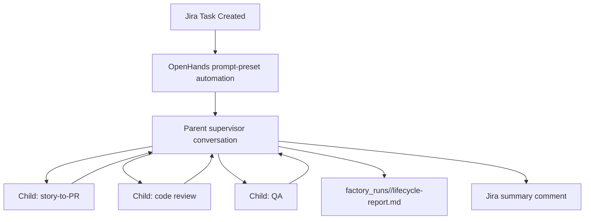

# Replicated Jira Delegated Factory Demo

This is the opt-in Rajistics Replicated version of the delegated SDLC demo. It
does not change the existing GitHub-label automations or the existing Jira
`jira-to-story` automation.

## Demo Promise

Start with a Jira Task. Rajistics OpenHands starts one parent supervisor
conversation. The parent stays alive, creates child conversations for
story-to-PR, code review, and QA, waits for their final responses, writes a
lifecycle report, and posts one summary comment back to Jira.

The customer-facing point is:

```text
The Jira ticket starts one OpenHands supervisor. The supervisor delegates the
specialized work to skills-backed child conversations, then reports the whole
software delivery lifecycle back in Jira.
```

## Files

| Path | Purpose |
| --- | --- |
| `automations/replicated-jira-delegated-factory/automation.prompt-preset.json` | Opt-in prompt-preset automation package for the Rajistics `jira-direct` webhook. |
| `automations/replicated-jira-delegated-factory/prompt.md` | Parent supervisor prompt. |
| `automations/replicated-jira-delegated-factory/workcells/*.md` | Child conversation prompt contracts. |
| `scripts/run_replicated_factory.py` | Parent-side orchestrator run by the supervisor. |
| `scripts/openhands_v1_delegate.py` | Dependency-free V1 app-conversation helper. |
| `scripts/register_replicated_factory_automation.py` | Prompt-preset registration helper; forwards the configured model profile and expands repo/ref placeholders into the stored prompt. |
| `skills/delegated-conversation-factory/` | Reusable pattern skill customers can copy/adapt. |

## Runtime Shape



## Required Rajistics Setup

The `jira-direct` custom webhook source must already exist on
`https://app.replicated.rajistics.com`, and Jira must send signed Task-created
events to it.

Store these values in the Rajistics OpenHands secret store:

```text
OPENHANDS_API_KEY_RAJISTICS
JIRA_API_TOKEN
JIRA_API_BASE_URL
JIRA_SITE_URL
JIRA_AUTH_MODE
JIRA_SERVICE_ACCOUNT_EMAIL
```

For the full delegated run, the parent automation needs enough active runtime
to wait for child conversations. Use `timeout: 3600` in this opt-in package and
make sure the Replicated automation service allows a matching
`AUTOMATION_MAX_RUN_DURATION`.

## Register The Opt-In Automation

Dry-run the payload:

```bash
python3 scripts/register_replicated_factory_automation.py --dry-run
```

Apply only when ready to create the new automation:

```bash
python3 scripts/register_replicated_factory_automation.py --apply
```

This script registers only the opt-in delegated factory package. It does not
register or modify the existing automation packages.

## Live Demo Script

1. Create a Jira Task in project `KAN`, for example:
   `Filter pets by max adoption fee`.
2. Show the Rajistics parent OpenHands conversation created by the automation.
3. Show the parent running `scripts/run_replicated_factory.py`.
4. Open the child conversation links for story-to-PR, code review, and QA.
5. Show `factory_runs/<run-id>/lifecycle-report.md`.
6. Show the Jira comment summarizing the delegated run.
7. Point to `skills/delegated-conversation-factory/` as the reusable pattern.

## Reusable Customer Pattern

Customers adapt four things:

- the parent supervisor prompt
- the child work-cell prompts
- the repo-local skills and deterministic helper scripts each child should use
- the parent orchestrator defaults and source-system glue

The orchestration rule stays the same: one parent conversation is the control
plane, child conversations own bounded work, final responses are small contracts,
and humans keep authority over review, merge, deploy, credentials, and
production changes.

The app-specific parts are intentionally isolated in `scripts/run_replicated_factory.py`
and the work-cell prompts. For another application, expect to edit Jira/ADF
parsing, project-key defaults, comment posting, repo/ref defaults, work-cell
order, and any demo story hints such as the Petstore max-fee example.

Child conversations run in separate OpenHands sandboxes. The parent always
captures each child final response as `factory_runs/<run-id>/<cell>.final.md`.
If a child writes `factory_runs/<run-id>/<cell>.md` inside its own sandbox, that
file is visible to the parent only if the child commits or pushes it.
